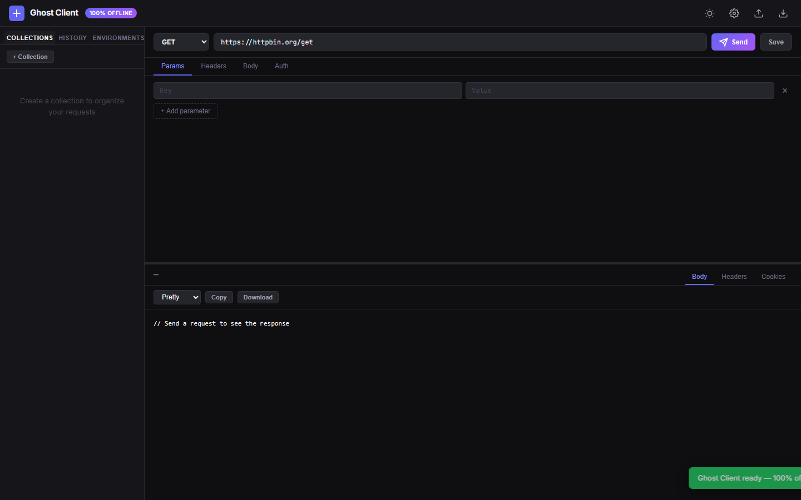

```
                     .-.
                    ("  )
                     /|
                    / |
                   /  |
              .-""-/   \-.         G H O S T   C L I E N T
             /        oo  \\        a privacy-first api client
            |    ___      o |       that lives in your browser
            |   /   \      | |
             \  | o |     / /
              '-.___/.---' /
                   |     |_
                   |     __)         no telemetry. no cloud. no account.
                   |       \
                   |        |
                   |_________|

```

<p align="center">
  <a href="https://blackwh1te.github.io/ghost-client"><strong>try it live →</strong></a>
</p>

---

Most API clients treat your data like a product.

They sync your collections to their cloud. They phone home with telemetry. They lock basic features behind a login wall. They own your workspace even though *you* built it.

**Ghost Client doesn't.**

It runs entirely in your browser. Your API keys stay on your machine. Your collections live in your IndexedDB. There is no server, no database, no analytics beacon, no "we've updated our privacy policy" email.

Zero dependencies. Zero backends. Zero trust required.

---

## the fight card

| | Postman / Insomnia | Ghost Client |
|:---|:---|:---|
| Cloud required | yes | **never** |
| Telemetry | yes | **zero packets** |
| Works offline | no | **always** |
| Open source | no | **MIT** |
| Free forever | partially | **completely** |
| Bundle size | ~200MB installer | **~30KB** |
| Account needed | yes | **no** |

---

## what it does

```
┌─ REQUEST BUILDER ───────────────────────────────┐
│ GET ▼  https://api.github.com/users/BlackWh1te │
│                                                  │
│ [Params] [Headers] [Body] [Auth]                 │
│                                                  │
│ Authorization: Bearer {{github_token}}           │
│                                                  │
│              [  S E N D  ]                       │
└──────────────────────────────────────────────────┘
```

**7 HTTP methods.** GET, POST, PUT, PATCH, DELETE, HEAD, OPTIONS. Each one gets a color so you can scan your history at a glance.

**Collapsible JSON tree.** Not pretty-printed text. A real tree you can expand and collapse, with syntax highlighting that makes strings green, numbers red, and keys blue.

**Environment variables.** Write `{{baseUrl}}` or `{{apiKey}}` anywhere. Switch environments and every request updates instantly. No find-and-replace.

**Collections.** Save requests into named folders. Never lose that carefully crafted GraphQL mutation again.

**History.** Every request you send is logged. One click replays it exactly. Last 100 only — this isn't a surveillance tool.

**Auth that actually helps.** Bearer token, Basic auth, API key (header or query param). No digging through docs to remember the header format.

**Settings that stay set.** 20+ configurable options: theme (light/dark/system), font size, sidebar width, JSON indent, history retention, timeout defaults, and more. All persist to localStorage.

---

## the toolbox

Ghost Client isn't just a request sender. It ships with utilities that developers actually open separate browser tabs for:

| Tool | Use it when |
|:---|:---|
| **Code Generator** | You need to paste a working cURL, Fetch, Axios, or Python snippet into a PR |
| **cURL Import** | Stack Overflow gives you a `curl` command and you need to break it into parts |
| **JWT Decoder** | You're debugging auth and need to see the payload without leaving the app |
| **Base64** | You're handling basic auth headers or image data URIs |
| **URL Encode/Decode** | You're building query strings by hand |
| **JSON Diff** | You have "before" and "after" API responses and need to see what changed |
| **Collection Runner** | You want to smoke-test every endpoint without clicking 47 times |
| **Response Search** | The API returns 4000 lines and you need one key |

---

## look at it



*Dark mode. No distractions. Just you and the API.*

---

## use it right now

No install. No signup. No build step.

**Option 1:** Open [`index.html`](https://blackwh1te.github.io/ghost-client) in your browser.

**Option 2:** One-line local server:

```bash
git clone https://github.com/BlackWh1te/ghost-client.git
cd ghost-client
python -m http.server 8080
# open http://localhost:8080
```

**Option 3:** Don't even clone it. Save the raw `index.html` to your desktop. Double-click it. It works.

---

## who this is for

- Developers who are tired of logging into tools just to test an endpoint
- People working with sensitive APIs who don't want their traffic routed through a third-party cloud
- Anyone who believes their development environment should work on a plane
- Teams who want a shared Postman collection without the Postman

## who this is NOT for

- People who want "team collaboration" with real-time cursors and chat bubbles
- Enterprise buyers who need SSO and audit logs
- Anyone who thinks "cloud-native" is a feature

---

## the stack

One HTML file. One CSS file. One JS file. That's the entire application.

No React. No Vue. No build system. No `npm install`. No `node_modules` folder that takes 15 minutes to download and 3GB of disk. No webpack. No vite. No framework-of-the-month.

Just the platform. The way the web was meant to work.

| Layer | What |
|:---|:---|
| UI | Hand-written HTML + CSS |
| Fonts | Inter + JetBrains Mono |
| Storage | Browser IndexedDB |
| Runtime | Any browser from the last 5 years |
| Dependencies | **None** |
| Size | **~30KB total** |

---

## philosophy

> "The best API client is the one that doesn't spy on you."

This tool exists because the current state of developer tools is embarrassing. We've accepted that software we run locally needs accounts. That debugging an API requires internet access. That our request history is someone else's business intelligence.

Ghost Client rejects all of that. It's a single-page application in the original sense: one page, one purpose, no surveillance.

Your data is yours. Your tools should be too.

---

## roadmap

- [x] Code generator (cURL / Fetch / Axios / Python)
- [x] cURL import
- [x] JWT decoder
- [x] Base64 & URL utilities
- [x] JSON diff
- [x] Collection runner
- [x] Response search
- [x] 20+ settings (appearance, requests, responses, history)
- [ ] WebSocket support
- [ ] Response assertions / mini test runner
- [ ] Cookie jar visualization
- [ ] OAuth2 helper flow
- [ ] HAR import/export

Want something else? Open an issue. But remember: the answer to "can it do cloud sync?" is **no**. Forever.

---

## license

MIT — do whatever you want. Fork it. Rename it. Sell it. Embed it. The only requirement is keeping the license file intact.

Created by **[BlackWh1te](https://github.com/BlackWh1te)** because the tools we use should respect us.

---

<p align="center">
  <sub>if you found this useful, star the repo. if you didn't, don't.</sub>
</p>
